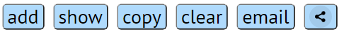

# extension-nix

Расширение позволяет выбирать объекты на сайте, формируя подборку. (Подборка в виде текстового сообщения с основными характеристиками объекта и ссылкой на источник). После набора объектов формируется подборка. Имеется возможность скопировать подборку в буфер обмена, поделится в мессенджер, отправить на почту.
____
Расширение представляет собой шесть кнопок:

____
1. Кнопка “add” - добавляет объект в подборку.

2.1 Кнопка “show” – отображает подборку (при нажатии заменяется кнопкой “hide”).

2.2 Кнопка “hide” – скрывает подборку (при нажатии заменяется кнопкой “show”).

3. Кнопка “copy” – копирует подборку в буфер обмена.

4. Кнопка “clear” – очищает подборку.

5. Кнопка “email” – отправка на почту.

6. Кнопка “share” – поделиться в мессенджер.
